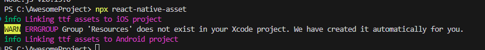

# Get Started Without a Framework


>**Note**: Make sure you have completed the [React Native - Environment Setup](https://reactnative.dev/docs/environment-setup) instructions till "Creating a new application" step, before proceeding.


## Step 1: Creating a new application

```bash
# using npm
npm uninstall -g react-native-cli @react-native-community/cli

npx @react-native-community/cli@latest init AwesomeProject
```

## Step 2: Start Metro

Let Metro Bundler run in its _own_ terminal. Open a _new_ terminal from the _root_ of your React Native project. Run the following command to start your _Android_ app:

```bash
# using npm
npm start

```

## Step 3: Start your application
npm run android

## Step 4: Steps to change the app icon follow the url
https://youtu.be/FRCWWvlTubQ

## Step 5: Modifying your app
Now that you have successfully run the app, let's modify it.

1. Open `App.tsx` in your text editor of choice and edit some lines.
2. For **Android**: Press the <kbd>R</kbd> key twice or select **"Reload"** from the **Developer Menu** (<kbd>Ctrl</kbd> + <kbd>M</kbd> (on Window and Linux) or <kbd>Cmd ⌘</kbd> + <kbd>M</kbd> (on macOS)) to see your changes!

   For **iOS**: Hit <kbd>Cmd ⌘</kbd> + <kbd>R</kbd> in your iOS Simulator to reload the app and see your changes!

### Add Custom fonts

1. Download the fonts from the google font
2. Create a fonts folder in the assets folder and add the downloaded font to this folder.
3. Create `react-native.config.js` file in the folder.

```bash
# change the path based on the folder placement
module.exports={
    assets: ['./assets/fonts']
}
```



4. Execute the below comment to link the assets to the project.

   ```bash
   npx react-native-asset
   ```


# React native animation

>**Note**: To create the react native animation we are using reanimated package for react-native.

>**Fixing the react-native-reanimated execution issues refer the below url**
>
> https://github.com/software-mansion/react-native-reanimated/issues/4726

```bash
npm install "react-native-reanimated": "^3.0.0-rc.3"
```

Learn about react native react-native-reanimated.
>Link : https://docs.swmansion.com/react-native-reanimated/docs/fundamentals/your-first-animation/

# Custom react -native- drawer

1. Set up to add the react-drawer to the app.

Import and create the states for drawer stack and navigator
```bash
import { createDrawerNavigator } from '@react-navigation/drawer';
import { createStackNavigator } from '@react-navigation/stack';
const Drawer = createDrawerNavigator();
const Stack = createStackNavigator();

```
Add the safearea and navigationncontainer , drawer navigation block in app return.

```bash
function App(): React.JSX.Element {
  return (
    <SafeAreaProvider>
      <NavigationContainer>
        <Drawer.Navigator >
          <Drawer.Screen name="Home" component={Welcome} />
        </Drawer.Navigator>
      </NavigationContainer>
      
    </SafeAreaProvider>
  );
}
```
Customize drawer 

```bash
 <SafeAreaProvider>
      <NavigationContainer>
        <Drawer.Navigator 
         drawerContent={props => <CustomDrawer {...props} />}
        >
          <Drawer.Screen name="Home" component={Welcome} />
        </Drawer.Navigator>
      </NavigationContainer>
      
    </SafeAreaProvider>
```
customDrawer.tsx
```bash
const CustomDrawer = (props:any) => {
    return (
        <View style={styles.drawerContent}>
            <DrawerContentScrollView {...props}>
                <View style={styles.EditprofileImageSec}>
                </View>
                <View style={styles.profileImageSec}>
                    <Image source={require("../assets/menu.png")} style={styles.profileImage} />
                    <Text style={styles.userName}>Shravanthi A N</Text>

                </View>
                <DrawerItemList {...props} />
                <DrawerItem label="Sign Out" onPress={() => Logout()} />
            </DrawerContentScrollView>
        </View>
    )
}

```
# Documentaion about react native reanimated

### Using an Animated component

* Let's start by having something that we could see on the screen. First, to create an animatable component you need to import an Animated object:

```bash
import Animated from 'react-native-reanimated';
```
This Animated object wraps React Native built-ins such as View, ScrollView or FlatList.

You use these components as any other JSX components:


```bash
import Animated from 'react-native-reanimated';

export default function App() {
  return (
    <Animated.View
      style={{
        width: 100,
        height: 100,
        backgroundColor: 'violet',
      }}
    />
  );
}
```

### Defining a shared value
A shared value is a driving factor of all your animations. You can think of it as a React state which is automagically kept in sync between the “JavaScript” and the “native” side of your app (hence the name). You create shared values using a `useSharedValue` hook:

```bash
import { useSharedValue } from 'react-native-reanimated';
```

As with any other React hook, you need to define it in your component's body. In a shared value, you can store any JS value like `number`, `string` or `boolean` but also data structures such as `array` and `object`.

```bash
import Animated, { useSharedValue } from 'react-native-reanimated';

export default function App() {
  const width = useSharedValue(100);

  return (
    <Animated.View
      style={{
        width,
        height: 100,
        backgroundColor: 'violet',
      }}
    />
  );
}
```
### Using a shared value
Let's create a very simple animation that will animate a `width` of an element. We'll make it expand by `50px` on each button press. We can do this by modifying a shared value connected to the `width` property of an `Animated.View` component.

Values stored in shared values are accessed and modified by their `.value` property.

There's no setter or anything - you simply mutate the `.value` property.

Let's define a `handlePress` function inside of which we'll modify the shared value:

```bash
import { Button, View } from 'react-native';
import Animated, { useSharedValue } from 'react-native-reanimated';

export default function App() {
  const width = useSharedValue(100);

  const handlePress = () => {
    width.value = width.value + 50;
  };

  return (
    <View style={{ flex: 1, alignItems: 'center' }}>
      <Animated.View
        style={{
          width,
          height: 100,
          backgroundColor: 'violet',
        }}
      />
      <Button onPress={handlePress} title="Click me" />
    </View>
  );
}
```
